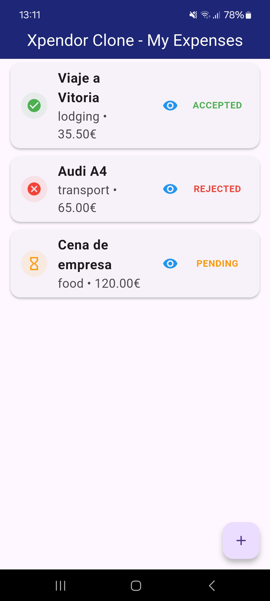
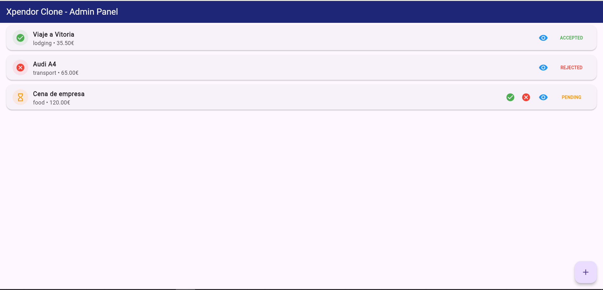

# Xpendor Clone - Expense Management System 💸

A cross-platform Flutter application designed to streamline expense reporting. This project features a dual-interface system: a **Mobile App** for employees to capture receipts and a **Web Admin Panel** for managers to review and approve expenses in real-time.

## ✨ Key Features

* **Dual Platform Experience:** * **Mobile:** Quick expense entry with photo receipt capture.
    * **Web:** Responsive dashboard for expense oversight and status management.
* **Real-time Cloud Sync:** Seamless data integration using Firebase Firestore.
* **Approval Workflow:** One-click "Accept" or "Reject" system with immediate status updates.
* **Receipt Storage:** Secure image hosting via Firebase Storage with built-in previewer.
* **Smart UI:** Context-aware components with tooltips and fixed alignments for a professional look.

## 🛠️ Tech Stack

* **Frontend:** [Flutter](https://flutter.dev) (Dart)
* **Backend:** [Firebase](https://firebase.google.com) (Firestore & Storage)
* **Media:** Image Picker for camera/gallery integration.
* **Architecture:** Layered Architecture (Models, Services, Screens, and Reusable Widgets).

## 📂 Project Structure

Following Flutter best practices, the project is organized by layers:

* `lib/models/`: Data structures and JSON serialization.
* `lib/services/`: Firebase logic and database interactions.
* `lib/widgets/`: Reusable UI components (like the custom `ExpenseCard`).
* `lib/screens/`: Main application views.

## 🚀 Getting Started

1.  **Clone the repo:**
    ```bash
    git clone [https://github.com/YOUR_USERNAME/xpendor_clone.git](https://github.com/YOUR_USERNAME/xpendor_clone.git)
    ```
2.  **Firebase Setup:**
    * Create a Firebase project.
    * Enable Firestore and Storage.
    * Add your `google-services.json` (Android) and `firebase_options.dart` (Web).
3.  **Install dependencies:**
    ```bash
    flutter pub get
    ```
4.  **Run the app:**
    ```bash
    flutter run
    ```

## 📸 App Preview

| Mobile Interface | Web Admin Panel |
| :---: | :---: |
|  |  |

---
*Developed as a showcase of Flutter & Firebase integration.*